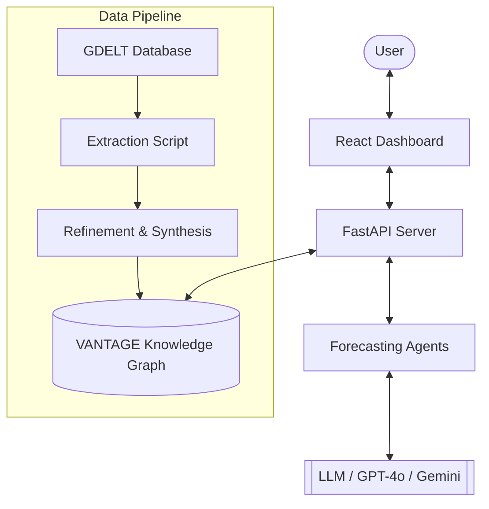
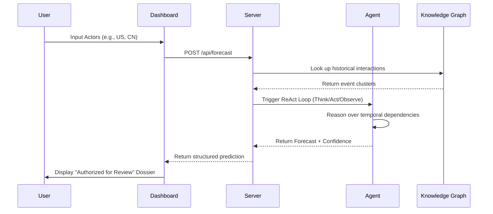

# VANTAGE Architecture

VANTAGE is built as a modular intelligence ecosystem, bridging massive global datasets with elite LLM reasoning agents.

## Core Components

### 1. **Frontend: The Tactical Dashboard**
Located in `/dashboard`, the React-based HUD provides a visual interface for investigating geopolitical links.
- **Conspiracy Board**: A relational mapping tool using `framer-motion` for fluid card interactions.
- **Diplomatic Barometer**: Real-time confidence visualization.
- **Dossier Export**: Generates physical-style reports for analytical review.

### 2. **Backend: Intelligence Bridge**
The `server.py` implementation acts as the orchestrator.
- **FastAPI**: Provides high-performance endpoints for the dashboard.
- **Knowledge Graph Interface**: Queries the processed GDELT events stored in `data/`.
- **Agent Bridge**: Triggers ReAct-style loops for complex reasoning tasks.

### 3. **The Forecasting Loop**

### 4. **Data Pipeline**
- **Harvesting**: `dataset_construction/` contains tools to pull raw event data from global indices.
- **Relational Mapping**: Synthesizes flat event logs into a relational graph suitable for agentic exploration.

## Tech Stack
- **Frontend**: React, Vite, Framer Motion, Tailwind CSS
- **Backend**: Python, FastAPI, Pandas, Uvicorn
- **Agents**: LangChain (logic), OpenAI/Gemini/Ollama (brains)
- **Data**: GDELT (Global Database of Events, Language, and Tone)
