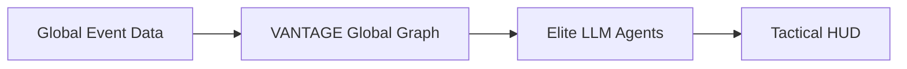

# <p align="center">VANTAGE: Autonomous Geopolitical Intelligence</p>

---

## Vision
**VANTAGE** (Virtual Agentic Network for Temporal Analysis and Global Events) is an elite, open-source framework designed to bridge the gap between static LLM reasoning and the dynamic, multi-hop complexity of international relations. 

In a world defined by information cascades and rapid geopolitical shifts, VANTAGE empowers autonomous agents to **investigate**, **reason**, and **anticipate** the future with unprecedented transparency.

## The Intelligence Stack



### Research-Grade Architecture
- **Autonomous Reasoning**: Implements the `ReAct` pattern, allowing agents to write and execute code against historical interaction graphs.
- **Massive Scale**: Powered by 260M+ events from the GDELT database.
- **Temporal Analysis**: Evaluates agents on their ability to handle multi-step temporal and relational logic over 30+ day horizons.
- **Dossier Generation**: Produces auditable "Dossiers" that break down complex forecasts into transparent reasoning steps.
- **Strategy Simulator**: Inject hypothetical variables (e.g., trade deals, sanctions) to observe agentic adaptation and ripple effects.

## Get Started

### 1. Requirements
- Python 3.9+
- Node.js 18+ (for Dashboard)
- OpenAI / Gemini API Keys

### 2. Installation
```bash
# Clone the intelligence suite
git clone https://github.com/thriniiiiiiiiiiii/VANTAGE-The-Future-of-Global-Event-Forecasting-.git
cd VANTAGE-The-Future-of-Global-Event-Forecasting-

# Initialize Python environment
pip install -r requirements.txt

# Start Dashboard
cd dashboard
npm install
npm run dev
```

### 3. Core Workflow
Explore the [Tactical Dashboard](dashboard/) to trigger your first autonomous forecast.

## Project Governance
- **[Architecture Deep-Dive](docs/architecture.md)**
- **[AI Pipeline Specification](docs/ai-pipeline.md)**
- **[Research Background](docs/research.md)**
- **[Strategic Roadmap](docs/roadmap.md)**
- **[Contributing Guidelines](CONTRIBUTING.md)**

---

  Made with deep commitment to the future of Agents.
</p>
