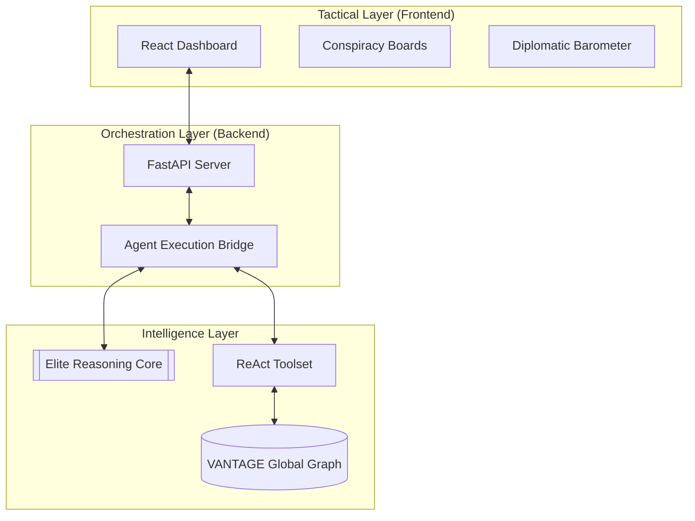

# Technical Architecture

VANTAGE is architected for modularity, scalability, and research fidelity.

## System Topology

## Key Components

### 1. The Global Graph (KG)
Built on GDELT data, the Global Graph is a temporal-relational database of events.
- **Schema**: Standardized CAMEO event coding.
- **Storage**: Optimized flat-files and embeddings for high-speed agentic retrieval.

### 2. ReAct Agent Bridge
The core reasoning engine that enables agents to interact with the environment.
- **Observation Space**: Historical interactions, news clusters, and temporal trends.
- **Action Space**: SQL-like queries against the KG, textual analysis, and hypothesis testing.

### 3. Tactical Dashboard
A high-performance React interface for visualizing agentic thoughts and forecast dossiers.
- **State Management**: React Hooks + Context.
- **Visuals**: Framer Motion for relational mapping (Conspiracy Board).
